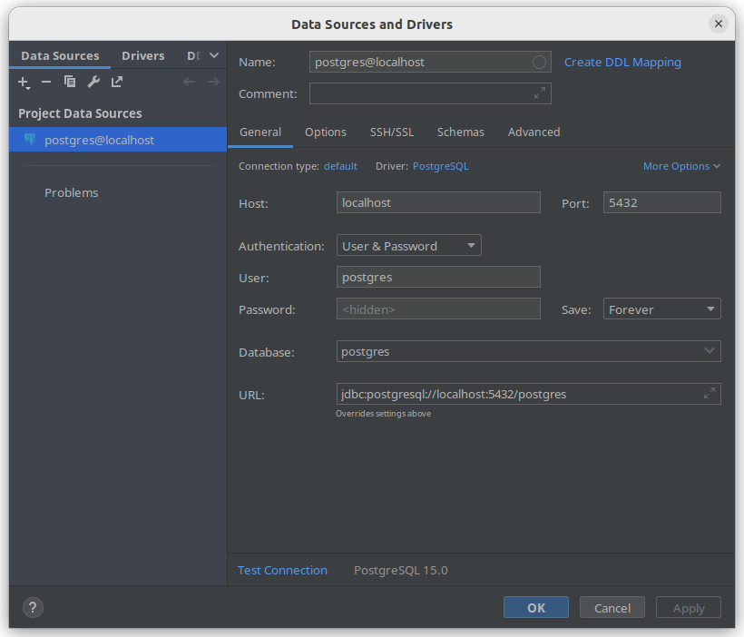

# Software Engineering 2 Project

## Datenbank

### Docker
Postgres Images holen
```
docker pull postgres:latest
```

Docker container starten
```
docker run --name se2-springbreak -p 5432:5432 -e POSTGRES_PASSWORD=super_mega_secret_password -e POSTGRES_USER=spring -e POSTGRES_DB=springbreak -d postgres
```

Wenn eingerichtet, kann der Container mit folgendem Befehl wieder gestartet werden
```
docker start se2-springbreak
```

**Tips**
Container entfernen
```
docker rm <conatiner_name>
```

IP Adresse vom Container
```
docker inspect -f '{{range.NetworkSettings.Networks}}{{.IPAddress}}{{end}}' container_name_or_id
```

**Einbindung Intellij**


### Nativ
Wird die Datenbank nicht über Docker bereitgestellt, müssen folgende Parameter in der Datenbank konfiguriert werden, um die Spring-Konfigurationsdatei nicht ändern zu müssen

```
POSTGRES_HOST=localhost
POSTGRES_PORT=5432
POSTGRES_DB=springbreak
POSTGRES_USER=spring
POSTGRES_PASSWORD=super_mega_secret_password
```