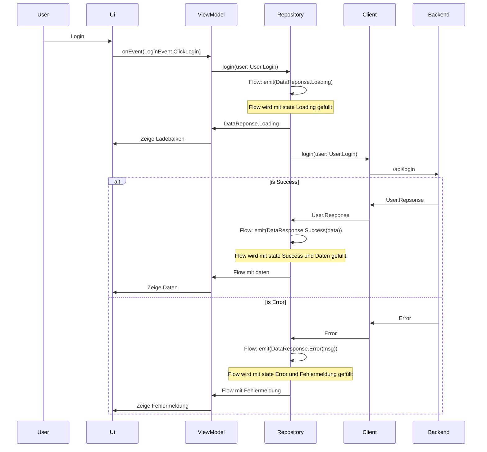

# Frontend (Kotlin/JS)

## Links

---

[MUI: The React component library you always wanted](https://mui.com/)

## Pages:

---

[Model](Frontend%20(Kotlin%20JS)%20b977eb61eed34bfbb98de7e437440567/Model%20486d761dba204766bff520c119eec91a.md)

[Client](Frontend%20(Kotlin%20JS)%20b977eb61eed34bfbb98de7e437440567/Client%209b767bcf3af64c1eb2810db7fe26c019.md)

[Notes - Notizen zum Frontend](Frontend%20(Kotlin%20JS)%20b977eb61eed34bfbb98de7e437440567/Notes%20-%20Notizen%20zum%20Frontend%20e40cac0fa02d41e2a3b1b418a1dd570d.md)

[Repository](Frontend%20(Kotlin%20JS)%20b977eb61eed34bfbb98de7e437440567/Repository%204fe68c294fa14e3bbced72750259e130.md)

[ViewModel](Frontend%20(Kotlin%20JS)%20b977eb61eed34bfbb98de7e437440567/ViewModel%20b9bb390a6f7f4bf69b838e92e485a5c2.md)

## Ablauf

### Siehe

